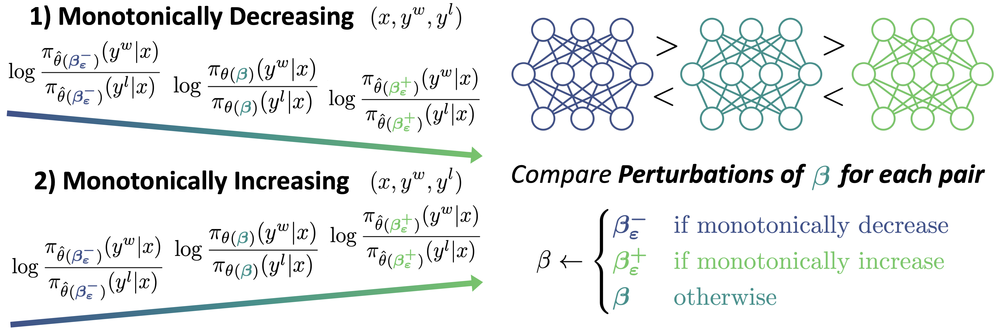

# 🎚️ $\varepsilon$-Direct Preference Optimization ($\varepsilon$-DPO)
> [**KL Penalty Control via Perturbation for Direct Preference Optimization**](https://arxiv.org/abs/2502.13177),            
Sangkyu Lee<sup>1,*</sup>,
Janghoon Han<sup>2;</sup>,
Hosung Song<sup>2</sup>, 
Stanley Jungkyu Choi<sup>2</sup>, 
Honglak Lee<sup>2,3</sup>,
Youngjae Yu<sup>1</sup><br>
<sup>1</sup>Yonsei University,
<sup>2</sup>LG AI Research, 
<sup>3</sup>University of Michigan, Ann Arbor<br>
<sup>\*</sup>Work done during internship at LG AI Research

<p align="center">
  
</p>

This is the official repository of **"KL Penalty Control via Perturbation for Direct Preference Optimization"**:

- `EpsilonDPOTrainer` and `EpsilonDPOConfig` for $\varepsilon$-Direct Preference Optimization ($\varepsilon$-DPO)
- Example training script for `Mistral-Instruct` and `Llama-3-Instrut`

## Installation

`EpsilonDPOTrainer` and `EpsilonDPOConfig` is implemented based on the [`DPOTrainer`](https://huggingface.co/docs/trl/main/en/dpo_trainer#trl.DPOTrainer) and [`DPOConfig`](https://huggingface.co/docs/trl/main/en/dpo_trainer#trl.DPOConfig) of [`trl==0.13.0`](https://github.com/huggingface/trl). Therefore, they should work fine in environments compatible with this version. For following our environment, please make sure to set up your environment with `Python 3.10`, then follow the installation:

```
pip install -r requirements.txt
```

If you want to use [FlashAttention 2](https://github.com/Dao-AILab/flash-attention) when using included training script, you need to install `flash-attn`:

```
pip install flash-attn --no-build-isolation
```

## Usage

`EpsilonDPOTrainer` shares arguments with `DPOTrainer`; it is straightforward to use as follows:

```python
from config import EpsilonDPOConfig
from trainer import EpsilonDPOTrainer

...

args = EpsilonDPOConfig(**args)
trainer = EpsilonDPOTrainer(model=model,
                            ref_model=ref_model,
                            args=args,
                            processing_class=processing_class,
                            train_dataset=train_dataset,
                            eval_dataset=eval_dataset)
trainer.train()
```

Here, `EpsilonDPOConfig` additionally requires one more argument from `DPOConfig`:
- `epsilon: float=0.01`; Parameter controlling the step size of KL penalty relaxation.

The included example training scripts can be used as:

```
# Mistral-Instruct
accelerate launch --config_file=configs/accelerate.yaml train.py --config=configs/mistral_instruct.yaml

# Llama-3-Instruct
accelerate launch --config_file=configs/accelerate.yaml train.py --config=configs/llama3_instruct.yaml
```

If you want to enable FlashAttention 2, please uncomment the `attn_implementation: "flash_attention_2"` in `configs/mistral_instruct.yaml` and `configs/mistral_instruct.yaml`.